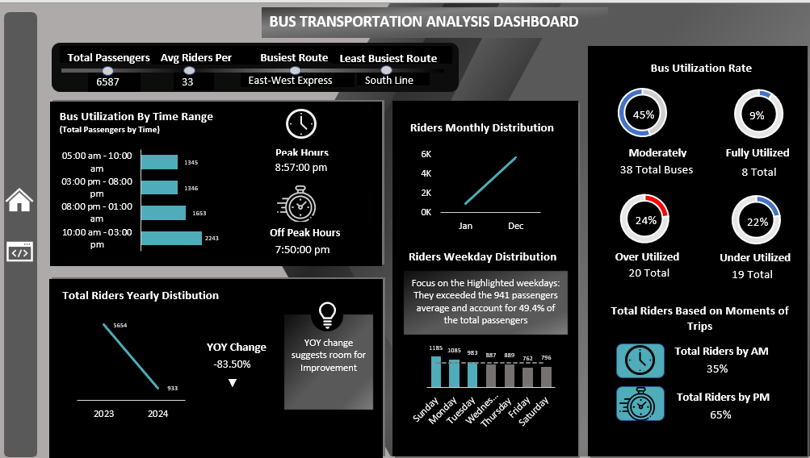

# Transportation-Analysis-Dashboard

This project includes a simple Excel dashboard created as part of a data mentorship project. It analyzes public bus transportation trends to help identify issues and opportunities in transit operations.

## 📸 Dashboard Preview

## 📂 Files Included
- **Dataset.xlsx** – Raw data used for the dashboard  
- **Bus_Transportation_Dashboard.xlsx** – The Excel dashboard file  
- **Dashboard_Screenshot.png** – A snapshot of the final dashboard

## 🔍 Key Insights
- Ridership dropped -83.5% YoY (from 5,654 to 933)  
- East-West Express is the busiest; South Line underutilized  
- 24% of buses are over-utilized; 22% under-utilized  
- Sunday–Tuesday have the highest ridership  
- 35% of riders travel in AM; 65% in PM
